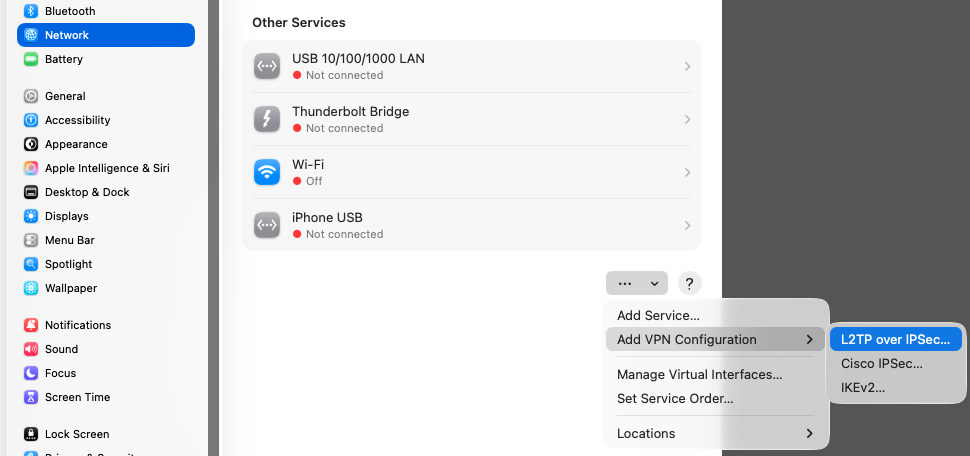

This operating system provides a native IPSec VPN client. Here are the steps to set up a VPN connection:

#### Create the VPN connection

1. Open *System Settings* > *Network*.
   
1. Click on the **...** popup menu, then on **Add VPN Configuration** > **L2TP over IPSec**:
   - **Display name:** Enter a name for your VPN connection (e.g., **acme-vpn**)
   - **Configuration:** Leave this as the default
   - **Server address:** Enter the public IP address from the *Remote access VPN* page
   - **Account name:** Enter the username for the VPN user created for you by your administrator
   - **User authentication:** Select *Password*
   - **Password:** Enter the password specified for the VPN user
   - **Machine authentication:** Select *Shared secret*
   - **Shared secret**: Enter the pre-shared key from the *Remote access VPN* page
   - **Group name:** Leave this blank
   
1. Click *Create*.
1. The new VPN is now listed on the *VPN* page.  Click the toggle switch to connect the VPN.
   

Optionally, you may enable the VPN module in the menu bar to access it more easily:
1. Open *System Settings* > *Menu Bar*.
1. Scroll to the *VPN* menu bar control.
1. Click the toggle switch to display the VPN module in the menu bar.
   
1. You can now connect to the VPN from the menu bar.
   