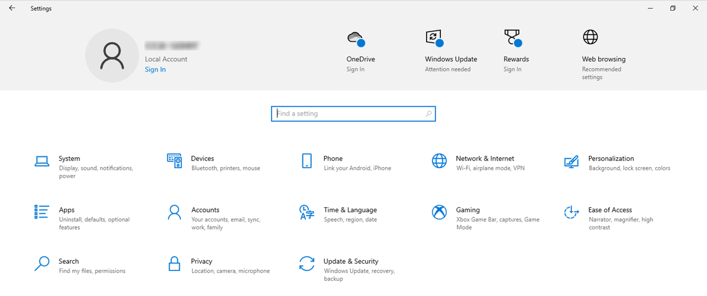
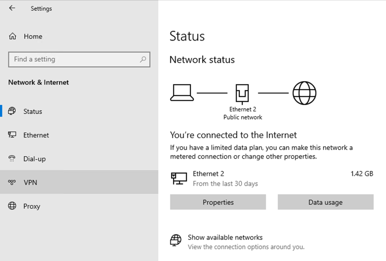
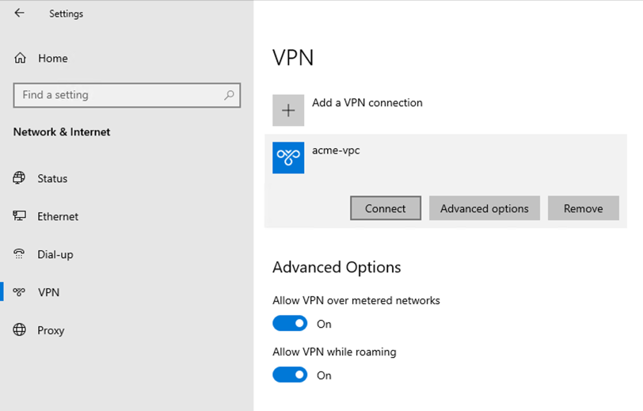
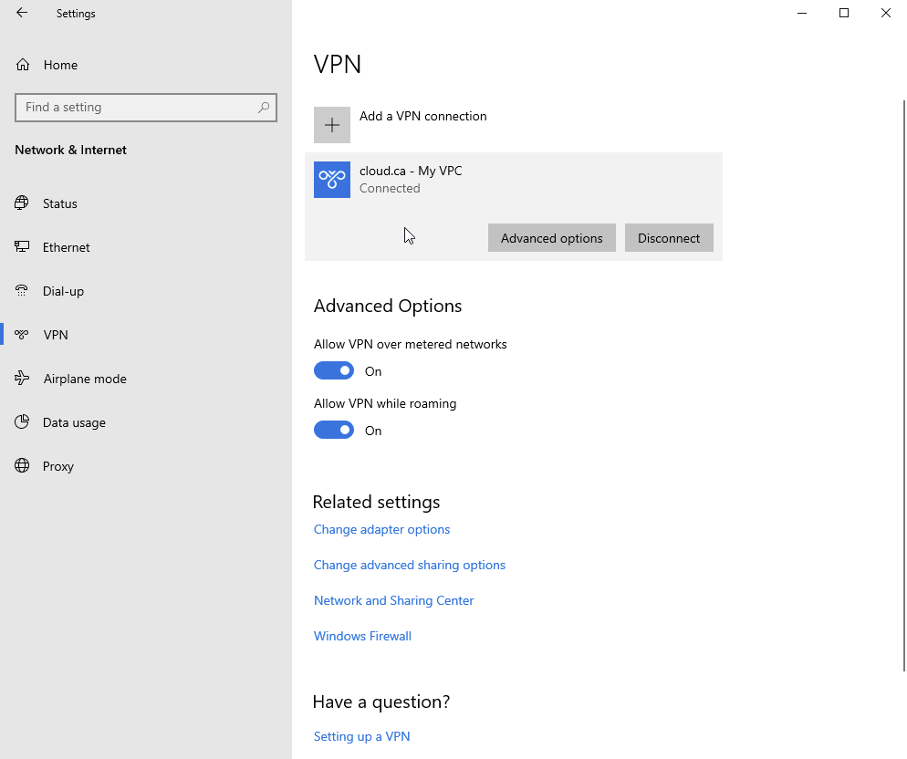

The following instructions apply to Microsoft Windows 10 using its native VPN client:

#### Create network VPN connection
1. Navigate to *Start menu* > *Settings* > *Network & Internet*.

2. Click on *VPN*.

3. Click on *Add a VPN connection*.

4. In the *Add a VPN connection* page:
- **VPN provider:**  *Windows (built-in)*
- **Connection name:**  Enter a name for your VPN connection (e.g., **acme-vpn**)
- **Server name or address:** Enter the public IP address from the *Remote access VPN* page
- **VPN type:** Select *L2TP/IPSec with pre-shared key*
- **Pre-shared key:** Enter the pre-shared key from the *Remote access VPN* page
- **Type of sign-in info:**  Select *User name and password*
- **User name:** Enter the username for the VPN user created for you by your administrator
- **Password:** Enter the password specified for the VPN user

5. Click *Save*.  The *VPN* page will appear and the new connection will appear in the list of connections.

#### Initiate VPN connection
1. Navigate to *Start menu* > *Settings* > *Network & Internet* > *VPN*.
2. Click on the desired VPN connection, then click on the *Connect* button.

3. The VPN is now connected.

<!--  -->
