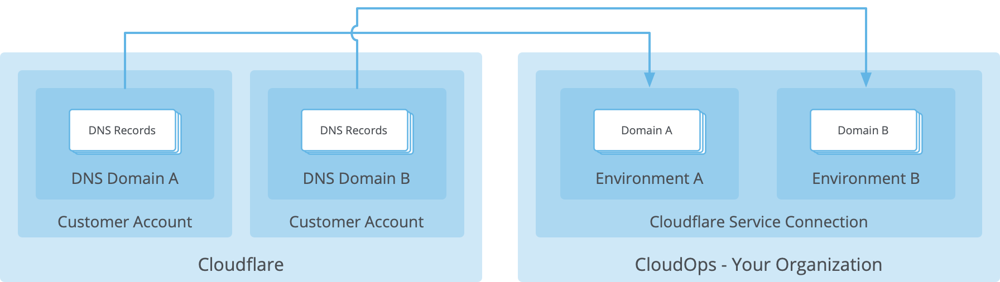
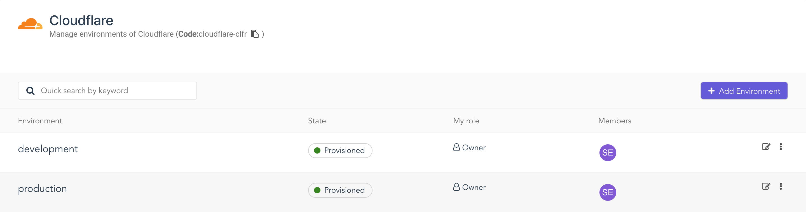
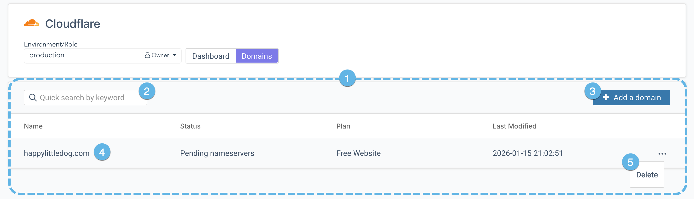
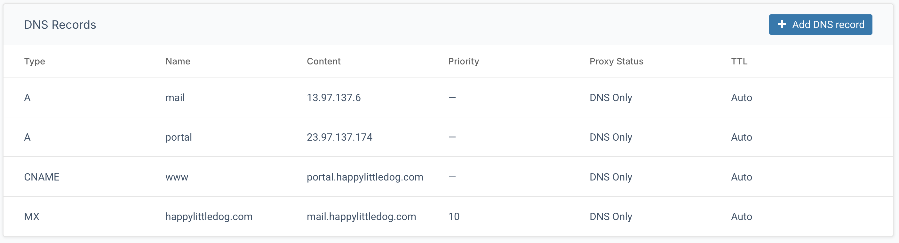

This article introduces the Cloudflare DNS service, for creating and managing domains, records, and accounts through CloudOps environments.

## Overview

The Cloudflare DNS service provides high-performance name resolution for large-scale applications, with global distribution and reliable security. CloudOps integrates with the DNS service by enabling management of zones, including adding and deleting DNS records. This integration allows multiple zones to be administered from a single CloudOps environment.

For DNS resolution to function properly, your domain must be configured at the name registrar to point to the Cloudflare name servers. Cloudflare will host the DNS records \(also known as **resource records**\) for your domain. The CloudOps interface provides a simple way to manage those resource records alongside your other cloud services.

To enhance performance and security, you may also choose to have Cloudflare proxy the traffic for your A, AAAA, and CNAME records. When a client makes a DNS query for the host name of a proxied DNS record, Cloudflare will return the IP address of its own front-end servers. When the client makes an HTTP or HTTPS request, the client will send the request to Cloudflare's servers, which will in turn make the request to the origin server, which is the server identified in your DNS record. This content will be returned in the response to the client, and will also be cached at the Cloudflare servers for faster retrieval.

## Environments

To begin working with Cloudflare resources, create a new environment in the Cloudflare service in CloudOps. Upon creating a new environment, a new account will be automatically created in Cloudflare, and associated to the CloudOps environment.

If there is an error when creating a new environment, it is possible that the Cloudflare API key used to create the service connection lacks the appropriate access. Contact your Cloudflare administrator and ensure that the master account has granted the API key with the following permissions:

-   `Zone.Zone Settings`
-   `Zone.Zone`
-   `Zone.DNS`
-   `Global xauth key`

## Domains

Clicking on an environment will take you to a list of the domains managed in that environment, where you will be able to add new domains. When adding a domain, you have the option to have the system scan your domain and import and existing resource records. After the domain is added, it will remain in the `Pending nameservers` state until the domain registrar is configured to point to the Cloudflare name servers.

1.  **List of domains**

    In the main area of the workspace, a list of all domains in the selected environment appears.

2.  **Search box**

    Type in the search box to filter the domain list. The system will search through the name and last modified fields, and returns any domain that matches the string in the search box.

3.  **Add a domain**

    Click to define a domain to be hosted by Cloudflare.

    Optionally, when creating the domain you may also import the existing DNS records for the target domain.

4.  **Domain entry**

    Each entry includes the name of the domain, the status of the domain configuration, the plan type, and the last modification date.

    Click on the entry to navigate to the details page for the domain.

5.  **Hidden Actions menu**

    Each entry in the domain list has a Hidden Actions menu. Click on the Hidden Actions menu to access a list of frequently-used operations for the domain.

## DNS records

Click on a domain to see the current name servers and their IP addresses, and a list all its resource records.

If the system detects that the domain registrar is not pointing this domain to the Cloudflare DNS servers, it will display an information message indicating that this step is required, and it will also provide the name servers and their IP addresses as they must be configured in the registrar.

The list of DNS records will contain the standard fields for each resource record, and it will also show if the traffic for that host name is proxied.

