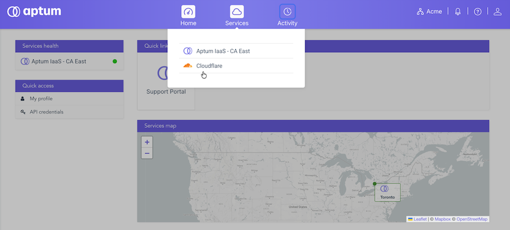

This article provides information about an important change to your DNS services. Aptum is retiring its legacy DNS platform and moving all services to Cloudflare for improved performance and reliability. This article explains what has changed, what you need to do, and the date by which you need to do it.

## Accessing your new portal

If you are the technical lead but did not receive credentials, please coordinate with your account’s primary contact. Your primary contact on file has received an email with access to the Aptum Portal, where your DNS services now live. The email will also indicate the date of the migration deadline.

If you haven't received it or need access for additional team members, please let us know by contacting your account manager or our support team at [support@aptum.com](mailto:support@aptum.com).

## What we've already done

Your DNS zones and their records have been imported into the new platform. Your existing DNS service continues to run unchanged until the migration deadline below, so both systems are live in parallel and nothing breaks while you migrate. The email that was sent to your primary contact includes a link to set up access to the new Aptum portal, where your DNS now resides.

**Important:** The automatic import copies most records, but it does not always capture everything. TXT records \(SPF, DKIM, DMARC\), some mail \(MX\) configurations, and less common record types can be missed or imported differently. Please treat the imported zone as a starting point to be verified, not a finished copy. The steps below include a verification step for exactly this reason.

## What you need to do

### Before you begin

-   You must have the login credentials to the Aptum Portal
-   You must have the URL and login credentials for your domain registrar

### About this task

Your domains must be switched to use Cloudflare's name servers.

Follow these steps to update your domain registrar and complete the DNS migration. Plan for roughly 15 to 20 minutes of active work per domain, plus up to 24 hours for each domain to activate after you switch, plus normal DNS propagation time.

### Procedure

1.  Log in to the Aptum Portal using the access you set up from your invitation email.

2.  From the **Services** menu, select **Cloudflare**.

    

3.  When the **Environments** page appears, select the environment where your domains have been added.

    **Tip:** The name of the environment with your migrated domains will be in the format `imported-[YYYY-MM-DD]`.

4.  For each migrated domain, verify your records before switching name servers.

    1.  Compare the records shown in the portal against your current, live DNS zone.

        Pay particular attention to MX and TXT records \(SPF, DKIM, DMARC\). If any are missing or incorrect, add or correct them in the portal now. If you switch name servers before fixing this, email and other services can break.

    2.  Check proxy status.

        Records imported as `Proxied` \(the orange-cloud icon\) route traffic through Cloudflare and change the address that resolves. This is usually fine for websites but will break mail servers, FTP, and any service that needs to reach your real IP directly. Set anything that should not be proxied to "DNS only" \(grey cloud\) before switching.

    3.  Check for DNSSEC.

        This is the most common cause of a domain going down during migration. If DNSSEC is currently enabled for the domain at your registrar, you must remove the existing DS record at the registrar as part of the switch. If you change name servers while the old DS record is still in place, the domain will fail validation and stop resolving entirely, even though everything looks correct.

        If you're unsure whether DNSSEC is enabled, contact us and we'll help you check.

5.  For each migrated domain with the **Pending name servers** status, identify its domain registrar.

    If you do not already know the registrar for a domain, use either the **Likely registrar** feature, or navigate to [lookup.icann.org](http://lookup.icann.org/) to identify your domain registrar.

6.  Locate and note your new name server assignments for each domain in the Aptum Portal.

    These new name server assignments point to the Cloudflare name servers. You will need this information to update your domain.

7.  In a separate browser tab or window, log into the portal for your domain registrar and locate the name server records for your domain.

8.  Switch the domain to use Cloudflare name servers.

    Update the name server records to point to the Cloudflare name servers you noted in step 6.

9.  Return to the Aptum Portal, select the **…** icon next to the domain entry to start a name server scan.

    The scan may take up to 24 hours to complete.

10. Once the domain is in the **Active** status in the Aptum Portal, confirm your website, email, and any other services on that domain are working normally.

    If anything looks wrong, you can safely revert by pointing the name servers back to your current ones while both platforms are still running, then contact us and we'll help sort it out.

11. You will need to repeat steps 4 through 10 for every domain with the **Pending name servers** status in the `Imported-YYYY-MM-DD` environment.

## Deadline

Our legacy DNS platform will be shut down on the date specified in the email that is specified in the invitation email.  After that date, any domain still pointing to the old name servers will stop resolving, meaning websites, email, and any other services tied to those domains will stop working. Please complete your updates before then to avoid interruption. We'd recommend not leaving it to the last day, so there's time to catch any issues while both systems are still running.

## We are here to help

The Aptum Customer Care team is available to assist you through this process. If you haven't received your portal access email, need a hand with name servers or DNSSEC, or have any questions, contact us at [support@aptum.com](mailto:support@aptum.com). You can also reference our migration documentation here: [https://portal.aptum.com/hc/cloudflare-service](https://portal.aptum.com/hc/cloudflare-service)

Thank you for your continued partnership.