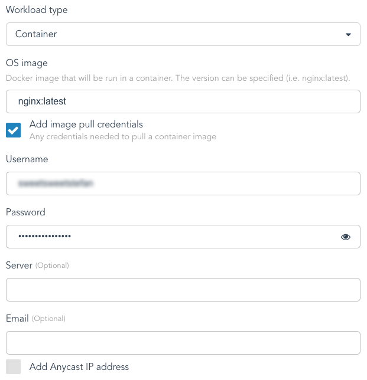
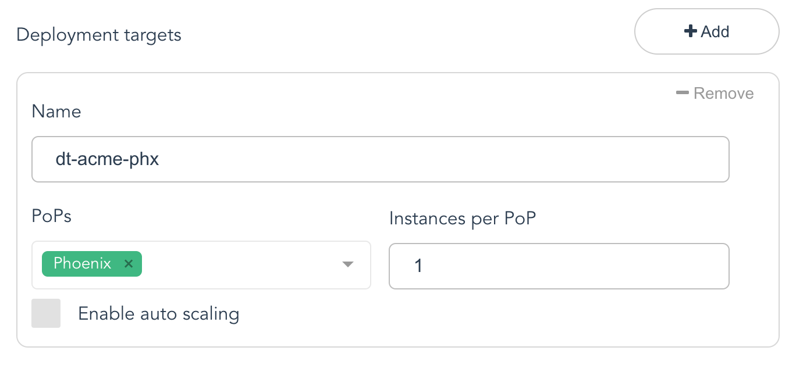
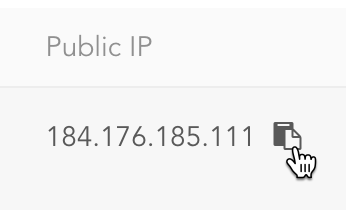

The StackPath service allows users to deploy containers and virtual machines to various points of presence \(PoPs\), which are globally distributed and support auto-scaling as well as other features. This article will guide you through the steps of deploying a container as a workload in your StackPath environment using the StackPath points of presence that you specify, and making it reachable from the public Internet.

## Prerequisites

- You must be familiar with StackPath workloads and their various features and options.
- You will need to have an environment configured in your StackPath connection.
- You must have the basic requirements of the application you wish to run:
    -   Number of vCPUs
    -   Memory
    -   Storage
    -   Network ports
- You must know which points of presence you wish to deploy to.
- You must understand the scalability options of your application before you can enable auto-scaling.

## Steps

1.  Navigate to the desired environment and click **Add workload**.

2.  Enter the desired name for the workload.

3.  From the **Workload type** popup menu, select `Container`.

4.  In the **OS image** text box, enter the name of the Docker image to use for the container.

    Docker images often have a variety of flavors, and have tags such as `latest` and `stable`, or the specific version of the image, such as `1.21.3`. If you wish to use a specific version of the image, you may use the format `name:tag`, for example, `nginx:1.20.1`

    Images from other registries may be used, as long as the URL conforms to the Docker format. The URL may be supplied with the image name in the format `URL:name:tag`.

5.  Check the box for **Add image pull credentials**.

    Fields for entering credentials will appear. You may use the user name and password for your Dockerhub account, or the credentials for whichever image registry you have specified.

    **Note:** We recommend using your own credentials when pulling from Dockerhub. Although images can be pulled anonymously by leaving this box unchecked, rate limiting may be applied and could cause your deployment to fail.

6.  Check the box labeled **Add Anycast IP address** if you need an Anycast IP address to be allocated for your container.

    A private and a public IP address will be allocated for your container, whether or not you select an Anycast IP address.

7.  If you need to pass data to your container, you can do so using the **Environment variables** and **Secret environment variables** fields.

8.  To automatically open a port on the container's public IP address, enter the port number into the text field under **Public ports**. To add more ports, click the **+** button.

    The system will automatically create the network rule using `0.0.0.0/0` as the source CIDR.

9.  Enter a desired command into the **Commands** field, and it will be executed automatically when the container is launched.

    The syntax of the command must be in Docker `run` *exec form*, where each whitespace character breaks the command into a separate *word* \(or *token*\). You must then enter each word into a command field. Each command field accepts exactly one word. Press the **+** button to add additional fields. For example, to execute the command `/bin/sh -c 'dmesg | grep Fail`, enter `/bin/sh` into the **Command** field, press **+**, enter `-c` into the second field, press **+**, and enter `'dmesg | grep Fail'` into the third field.

    This is an advanced feature that allows you to override the default command string in the image's Dockerfile, and requires knowledge of how the image was created. See the documentation for your container to find more information. Note that if the image's Dockerfile does not specify the default command to execute in the `ENTRYPOINT` parameter of the Docker `run` command, you will need to include that command in your command string to prevent the container from failing to launch as expected.

10. Select the desired specifications for compute, memory, and the size of the root disk, as well as for optionally attaching a persistent new storage volume to the container.

11. Choose one or more deployment targets for your container workload.

    Each deployment target includes a name, a point of presence, and scaling information. By default, auto-scaling is disabled, and the system will launch exactly the number of instances defined in the **Instances per PoP** field at each PoP.

    If auto-scaling is desired for a deployment target, check the box labeled **Enable auto scaling** and select the desired values for the criteria to trigger auto-scaling using the three fields that appear:

    -   **CPU utilization**: The system will monitor the CPU utilization of each instance or container. When utilization exceeds the specified threshold, a new container will be deployed to absorb the increased load. When CPU utilization drops to 10% below this threshold or lower, the system will scale down instances after 5 minutes have passed since the last auto-scaling event.
    -   **Min instances per PoP**: The minimum number of containers to have deployed at any time.
    -   **Max instances per PoP**: The maximum number of containers to deploy when scaling up.
12. Click **Submit**.

## Result

-   The configured number of containers will be deployed in each of the specified PoPs, with any applicable auto-scaling rules.
-   The container\(s\) will be running the requested image.
-   They will be assigned the listed private and public IP addresses.
-   Only the specified network ports will be open for incoming traffic from the public Internet.

## Example

### Configuration

In this example, we will deploy a container running an Nginx image into our Staging environment. Using a command string we will customize our `index.html` page at deployment time.

Our application has the following requirements:

-   1 vCPU
-   2 GB memory
-   5 GB disk storage
-   Port 80/tcp for Web traffic

We will have one deployment target, in Phoenix, and we will not enable auto-scaling. We will deploy the container with a command that will overwrite the default Nginx page with a plain text "Hello, world!" greeting.

1.  Navigate to our Staging environment and click **Add workload**.

2.  Enter `wl-phx-nginx01` as the name for the workload.

3.  From the **Workload type** popup menu, select `Container`.

4.  In the **OS image** text box, enter `nginx:latest` as name of the Docker image to use for the container.

5.  Check the box for **Add image pull credentials**. Fields for entering credentials will appear. Enter the user name and password for your Dockerhub account. Leave the **Server** and **Email** fields blank.

    

6.  Leave the **Add Anycast IP address** field empty.

7.  Leave the **Environment variables** and **Secret environment variables** empty.

8.  Enter the value `80` into the text field under **Public ports**.

    This will allow us to test our container after it is deployed, using a Web browser to make a request to port 80.

9.  Enter the command to overwrite the default `index.html` file with our desired string.

    1.  Enter the string `/bin/sh` into the **Commands** field, and press the **+** button.

        A new field will appear below the first command.

    2.  Enter the string `-c` into the second field, and press the **+** button.

    3.  Enter the string `echo '<html><body>Hello, world!</body></html>' > /usr/share/nginx/html/index.html; nginx -g 'daemon off;'` into the third field.

    Because this image's Dockerfile uses the `run` command's `CMD` parameter to launch Nginx at container launch, we must include the `nginx -g 'daemon off'` command to start the Nginx process manually. The [Nginx container documentation](https://hub.docker.com/_/nginx) provides more details on this behavior.

    

10. From the **Spec** pop-up menu, select `SP-1` as the specification for the container.

11. Configure the deployment target with the following settings: and select Phoenix as the PoP.

    1.  Enter `dt-acme-phx` into the **Name** field.

    2.  From the **PoPs** pop-up menu, select Phoenix as the point of presence.

    3.  Leave **Enable auto scaling** unchecked.

    4.  Leave the default of 1 under **Instances per PoP**.

        

12. Click **Submit**.

### Testing

We will verify that the Nginx container is deployed correctly, with port 80 open to the public, and with the customized "Hello, world!" greeting in the `index.html` file.

1.  Verify that the new workload, `wl-phx-nginx01`, is listed on the **Workloads** page.

    

2.  Click on the workload to view the details page, then click on the tab labeled **Network policies**.

    

3.  Verify that the inbound rule allowing port 80 is listed.

4.  Click on the **Overview** tab and scroll down to the **Instances** section. Verify that the container instance was deployed in the Phoenix point of presence.

    

5.  Copy the public IP address of the container into your clipboard by hovering your cursor over the IP address and clicking the clipboard icon when it appears.

    

6.  Open a new Web browser window and in the location bar, type `http://` then paste the IP address from your clipboard, and hit **Enter**.

    The browser window displays an empty page with the words, "Hello, world!" on the top line.
