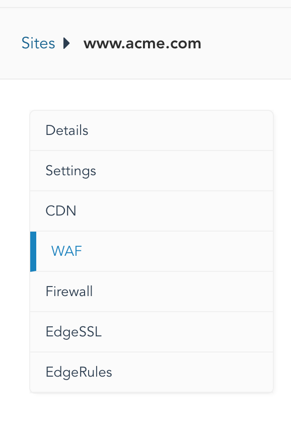
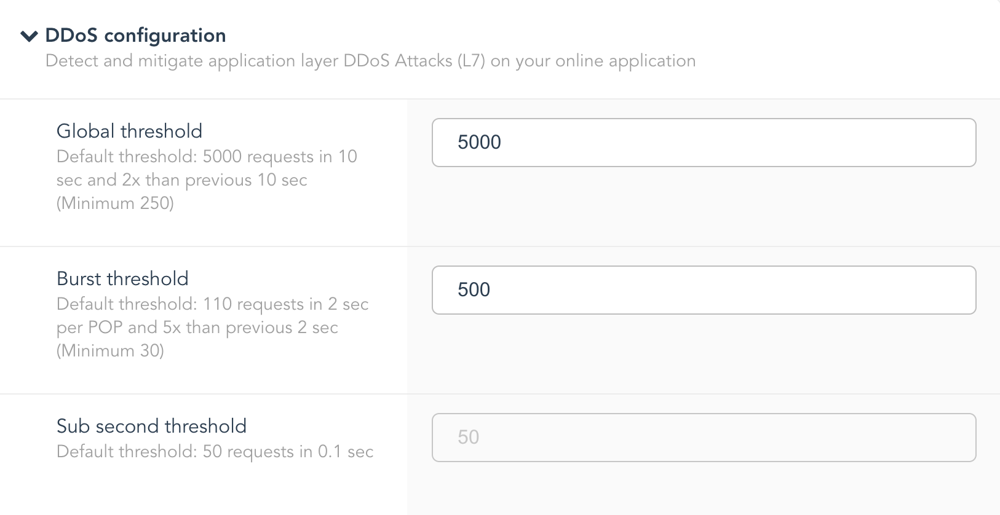
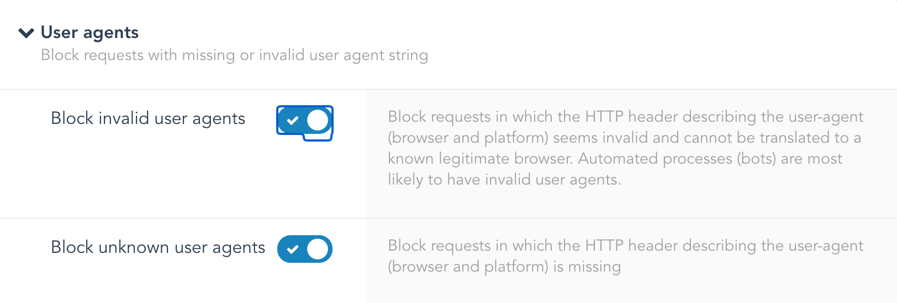

The StackPath Web Application Firewall (WAF) features allow you to protect your site from abuse and attacks at the application level.  A network firewall protects a network by accepting and denying connections based on IP address, type of protocol, port number, analysis of traffic patterns, and other network-level criteria.  By contrast, a WAF looks at traffic not as connections and packets on a network, but instead as requests coming into your Web application.  Because there are many vectors by which malicious activity can target your application, the WAF analyzes a broad set of characteristics of incoming HTTP requests, some of which are quite sophisticated.

When traffic matches one or more of these conditions, the WAF may take action on the request.  One action is to *block* the request, meaning that the request will not be passed downstream to the CDN nor to the origin server, and will also not respond to the client.  This is clearly a final approach and may leave a legitimate user with no recourse other than to contact your support team.  The other action is to *challenge* the request, whereby the WAF will hold the request and respond to the client with either a Captcha or a JavaScript validation, allowing the user to prove that they are not a bot or automated tool.

Users must have the *User* role or higher, and be a member of the target environment with the environment role *Editor* or *Owner* to manage StackPath WAF settings.

Navigate to the desired StackPath service, click on the desired environment, click on the tab labeled *Sites*, click on the desired site, and then click on the *WAF* item to manage your site's WAF settings.  The site must have the WAF service enabled in order for the *WAF* item to appear on this page.  

The WAF service can be enabled on the site creation page, or anytime after the site is created by going to the *Sites* tab, clicking on the three-dot menu on the far right-hand side of the desired site, and selecting *Enable WAF*.

### Feature overview

- **WAF mode:**  Overall operation of the WAF.
  - **Protect:**  The WAF will apply and enforce the selected policies to incoming traffic.
  - **Monitor:**  The WAF will apply policies but will not block or challenge requests.  Requests that match a rule will be logged.  This mode is useful for testing.  We recommend when first enabling the StackPath WAF to select Monitor mode, to prevent traffic from being blocked while you are initally configuring the system.

- **API URL configuration:**  If your application offers an API that is served from a domain name that is protected by the StackPath WAF, this API **must** be identified to the WAF.  If this step is not taken, the WAF may block requests to the API and cause an interruption of service.  Because the host name is already known from the site configuration, simply add the path, or paths, to the text box.  For example, if your API is accessed at `https://www.acme.com/api/v2`, enter `/api/v2` into the text box.  Requests that begin with this path will be recognized as requests to your API (eg, `https://www.acme.com/api/v2/list`).  Multiple paths are supported.  Note that the path is not case sensitive.  The following WAF features will not be applied to requests sent to these paths:
   - JavaScript Injection
   - Captcha
   - Browser validation

- **DDoS configuration:**  The StackPath WAF will look for patterns in the volume of incoming requests over a 10-second window, a 2-second window, and a 1-second window.  The number of requests allowed within each of these windows is governed by the *Global*, *Burst*, and *Sub-second* thresholds.  The Sub-second threshold is controlled by StackPath and is not modifiable.  Depending on the type of traffic increase, the WAF may respond with a challenge for the end-user to prove they are a real human, or the traffic may be simply blocked.  DDoS protection is always active when the WAF is enabled for a site, even if the WAF is configured for Monitor mode.  Because of the potential impact to customers, it is important to coordinate business events such as promotions with the Operations team so that these settings may be increased accordingly, as a sudden increase in traffic may inadvertently trigger the DDoS protection.

- **WAP & OWASP top threats**
   - The StackPath WAF protects against a wide variety of common attack threats.  We recommend enabling all of these protections unless one or more of them interferes with your particular application.  The undesired options may be deactivated individually.  

- **User agents:**  When enabled, this functionality looks at the HTTP `User-Agent` header in all requests.
   - **Block invalid user agents:** The WAF will deny requests with an unrecognized value in the `User-Agent` header, possibly indicating a fake browser or bot.
   - **Block unknown user agents:** The WAF will deny requests that do not have a `User-Agent` header.

- **CSRF attacks:**  An attacker on a third site can trick unsuspecting users of a vulnerable application to make potentially damaging requests that the user is unaware of.  These are called Cross-Site Request Forgery (CSRF) attacks.  The WAF can protect against this by generating a token that is automatically added to forms served.  If the token is not present in the submitted form, that request will be blocked by the WAF.

- **Traffic sources**
   - The StackPath WAF identifies sources for traffic that could potentially be malicious in nature.  We recommend looking at each of these sources of traffic, and evaluating whether legitimate traffic could originate from it.  If no legitimate traffic is foreseen, enable the option to block requests from that source.

- **Anti-automation and bot protection**
   - Automated traffic, including bots, frequently exhibit certain characteristics that can give them away.  Requests that lack certain headers, those that fail to return cookies, and other behaviour can all be clues.  The WAF can look for these patterns and challenge or block traffic accordingly.  We recommend evaluating whether users of your application could match any of these criteria, then enabling protection against any that don't match your users' needs.

- Spam and abuse
   - Form submission validation

- Behavioral WAF
   - Spam protection: How does this differ from Spam and Abuse above?
   - Block probing and forced browsing
   - Obfuscated attacks and zero-day mitigation
   - Repeated violations
   - Brute force protection

- CMS protection
   - Various settings

- Allow known bots
   - Various settings

### External links

[ ] English
[ ] Français
[ ] Español

Doc spec:

*Document specification:* Article name here

*Overview:* KB article to ...

*Description of target audience:* CloudMC Users and/or Administrators

*Languages:* English, French, and Spanish

*Non-goals:*

*Estimated length:* Single article / Multiple articles

*Finer points:*

From SP// docs: With these instructions, you will enable a firewall product on your site, which may cause an interruption until the WAF is fully configured. As a result, StackPath recommends you enable the WAF when your website has low traffic.

From SP// docs: StackPath's WAF is comprised of a unique 2-tier SaaS.  The first tier is a cloud-based Central Security Cloud that analyzes traffic.  The second tier is edge nodes that enforce security policies and deliver services distributed by the cloud.

*Outline of document:* Sections for each function

*Reviewers and their responsibilities:*

*Outstanding issues:*

*Schedule:* ASAP.  Remember that if you're aiming to complete by release date, the last week or so there will be a lot of translations to work on.

Research:
https://support.stackpath.com/hc/en-us/articles/360037951331-Enable-WAF-on-an-Existing-Site <- Like a Quick Start guide
https://support.stackpath.com/hc/en-us/articles/360001082463-Learn-About-the-StackPath-WAF-
https://support.stackpath.com/hc/en-us/articles/360001405226-Learn-and-Configure-WAF-for-Application-Layer-DDoS-Protection
https://support.stackpath.com/hc/en-us/articles/360001447963 <- API endpoint in your app
