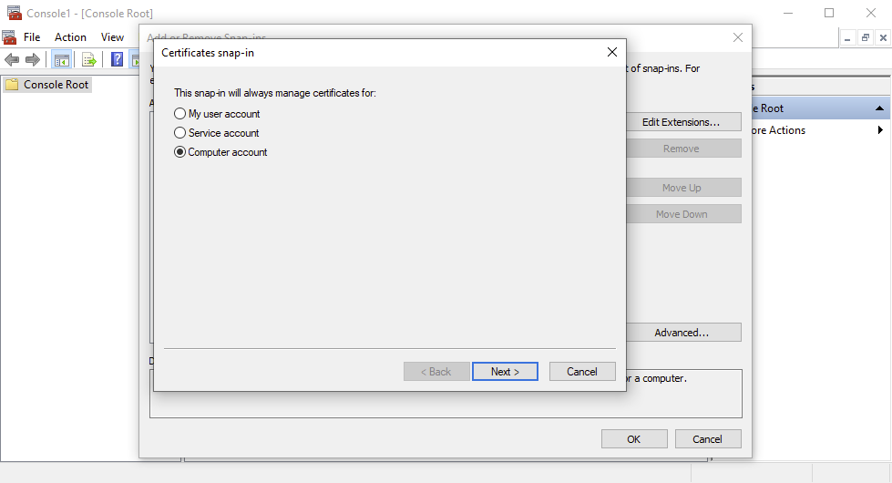
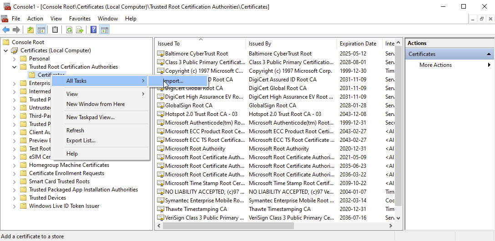
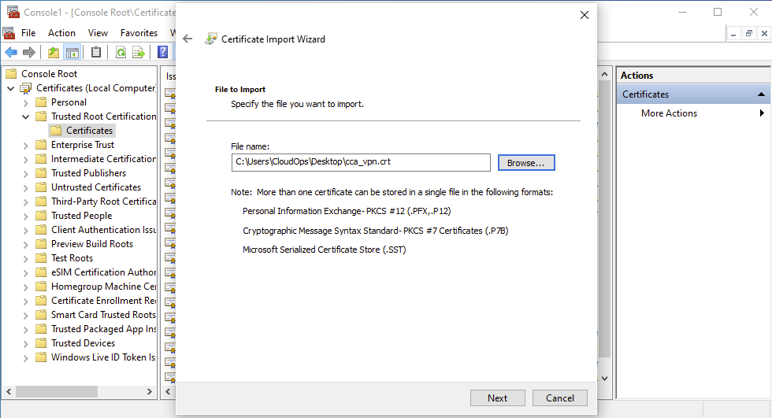
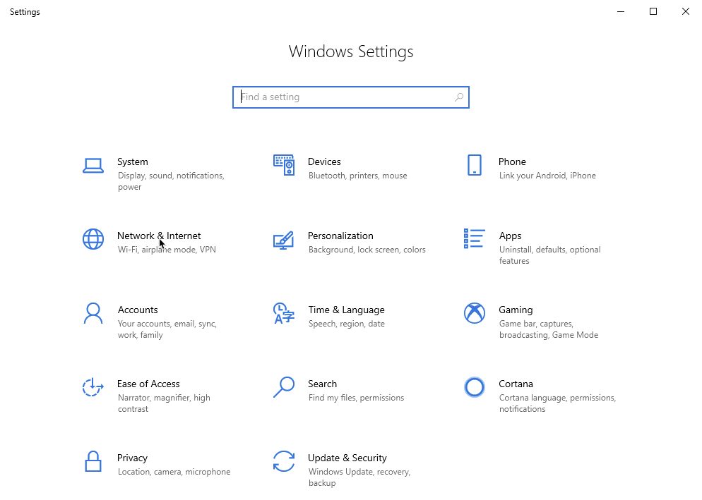
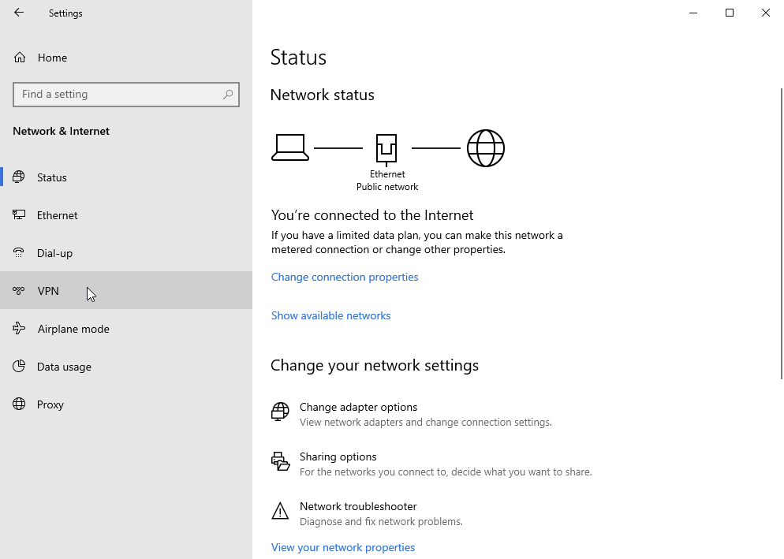
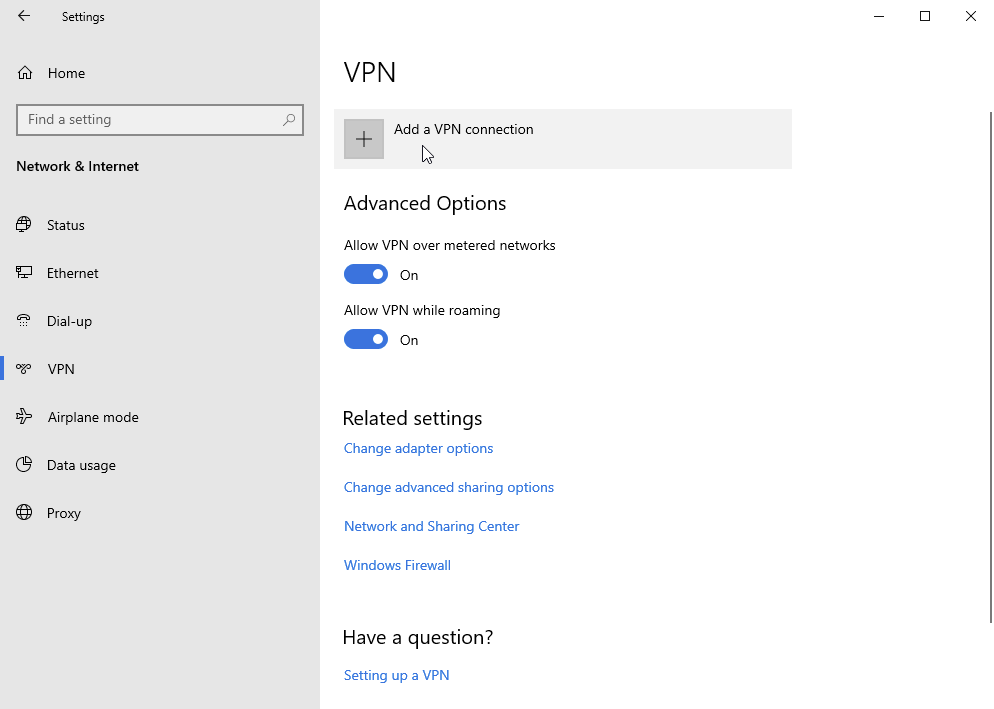
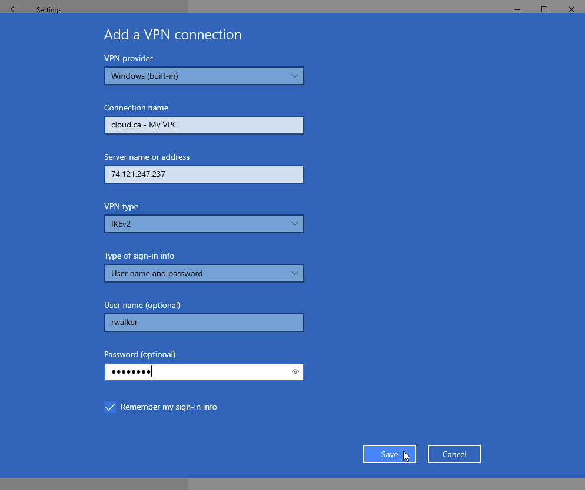
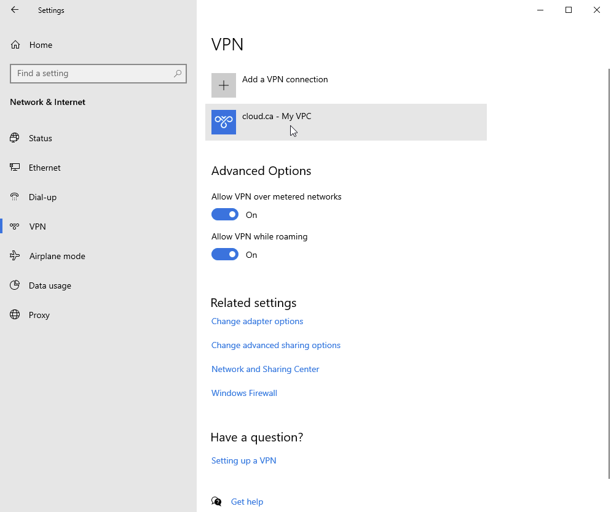
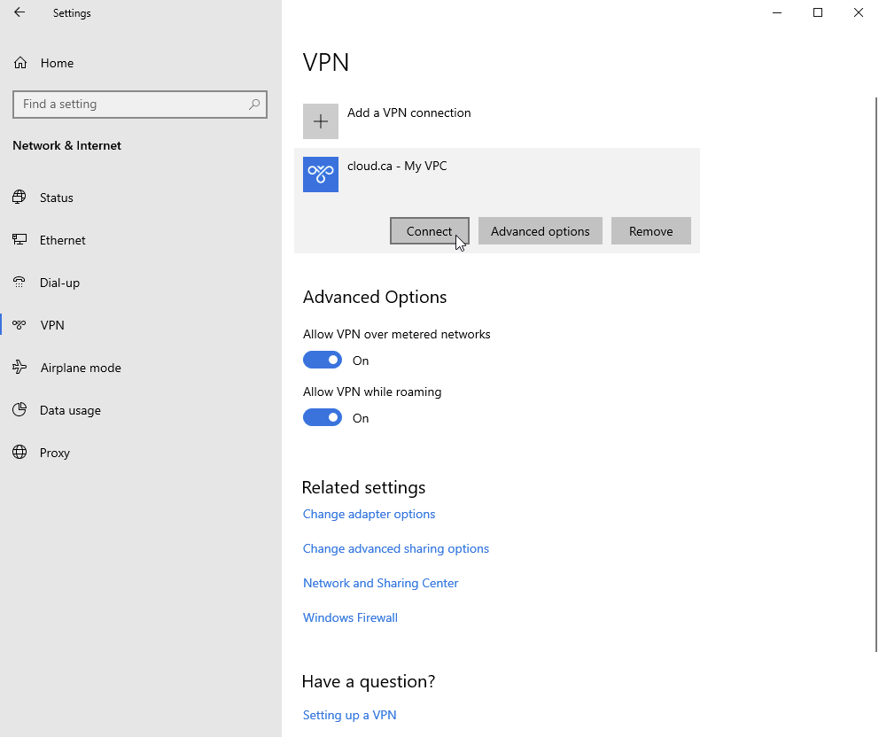
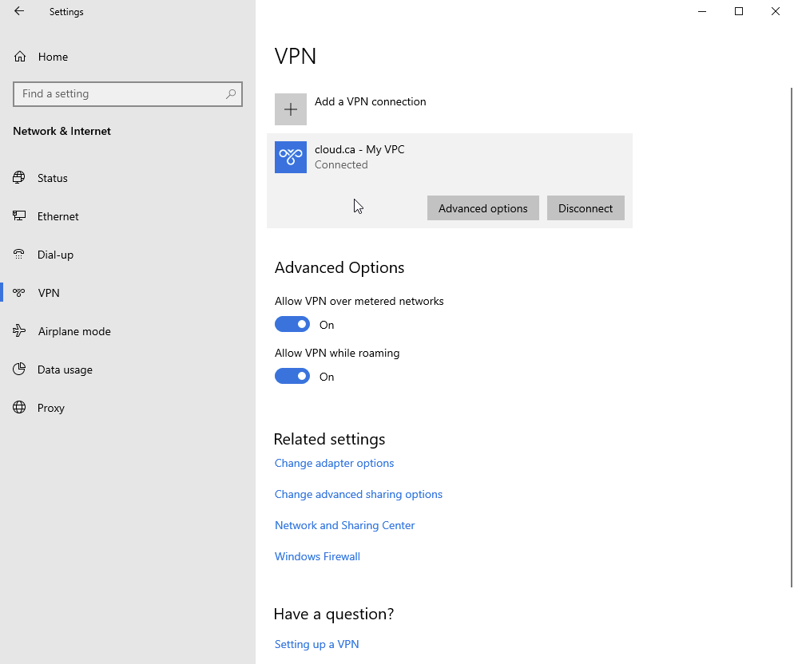

Las siguientes instrucciones se aplican a Microsoft Windows 10 usando su cliente VPN nativo:

#### Agregar el certificado a la lista de certificados de confianza

1\. Ejecuta `mmc.exe`
2\. Ve a *Archivos > Agregar/Eliminar complemento…*
3\. Selecciona *Certificados* de la lista de la izquierda y haz clic en *Agregar >*.
4\. En la ventana emergente, selecciona **Cuenta de computadora**.

5\. En la siguiente ventana, selecciona **Computadora local: (la computadora en la que se ejecuta esta consola)** y haz clic en *Finalizar*.
6\. De vuelta en la ventana de la consola, selecciona "*Raíz de consola > Certificados (equipo local) > Autoridades de certificación raíz de confianza > Certificados*.
7\. Haz clic derecho en *Certificados* y haz clic en *Todas las tareas > Importar…*.

8\. En la siguiente ventana, haz clic en *Siguiente*.
9\. Haz clic en *Examinar...* y selecciona el archivo de certificado que guardaste en el disco con la extensión **.crt** (el certificado se proporciona en la interfaz de usuario de CloudOps, en la página para configurar la VPN de administración remota) y haz clic en *Próximo*.

10\. Guarda **Coloque todos los certificados en el siguiente almacén: Autoridades de certificación raíz de confianza** y haz clic en *Siguiente*.
11\. Haz clic en *Finalizar*. Deberías ver el mensaje *La importación fue exitosa*. Puedes cerrar la ventana emergente y la Consola.
12\. Si tu servidor está detrás de un NAT, sigue este procedimiento: [Enlace de Microsoft](https://support.microsoft.com/en-us/help/926179/how-to-configure-an-l2tp-ipsec-server-behind-a-nat-t-device-in-windows-vista-and-in-windows-server-2008)

#### Crear conexión VPN de red

#### Iniciar conexión VPN

