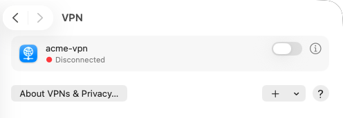
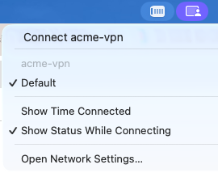

Este sistema operativo incluye un cliente VPN IPSec nativo. A continuación, se detallan los pasos para configurar una conexión VPN:

#### Crear la conexión VPN

1. Abre *Configuración del Sistema* > *Red*.
   
1. Haz clic en el menú emergente **...** y luego en **Agregar configuración de VPN...** > **L2TP sobre IPSec...**:
   - **Nombre mostrado:** Introduce un nombre para tu conexión VPN (p. ej., **acme-vpn**)
   - **Configuración:** Deje la configuración predeterminada
   - **Dirección del servidor:** Introduce la dirección IP pública que aparece en la página *VPN de acceso remoto*
   - **Nombre de la cuenta:** Introduce el nombre de usuario de la VPN que tu administrador te ha asignado
   - **Autenticación del usuario:** Selecciona *Contraseña*
   - **Contraseña:** Introduce la contraseña especificada para el usuario de la VPN
   - **Autenticación del equipo:** Selecciona *Secreto compartido*
   - **Secreto compartida:** Introduce la clave precompartida que aparece en la página *VPN de acceso remoto*
   - **Nombre del grupo:** Deja este campo en blanco
   
1. Haz clic en *Crear*.
1. La nueva VPN ya aparece en la página *VPN*. Haz clic en el interruptor para conectarte a la VPN.
   

Opcionalmente, se puede habilitar el módulo VPN en la barra de menús para acceder a él más fácilmente:
1. Abra *Configuración del sistema* > *Barra de menús*.
2. Desplácate hasta el control de la barra de menús *VPN*.
3. Haz clic en el interruptor para mostrar el módulo VPN en la barra de menús.
   
3. Ahora puedes conectarte a la VPN desde la barra de menús.
   