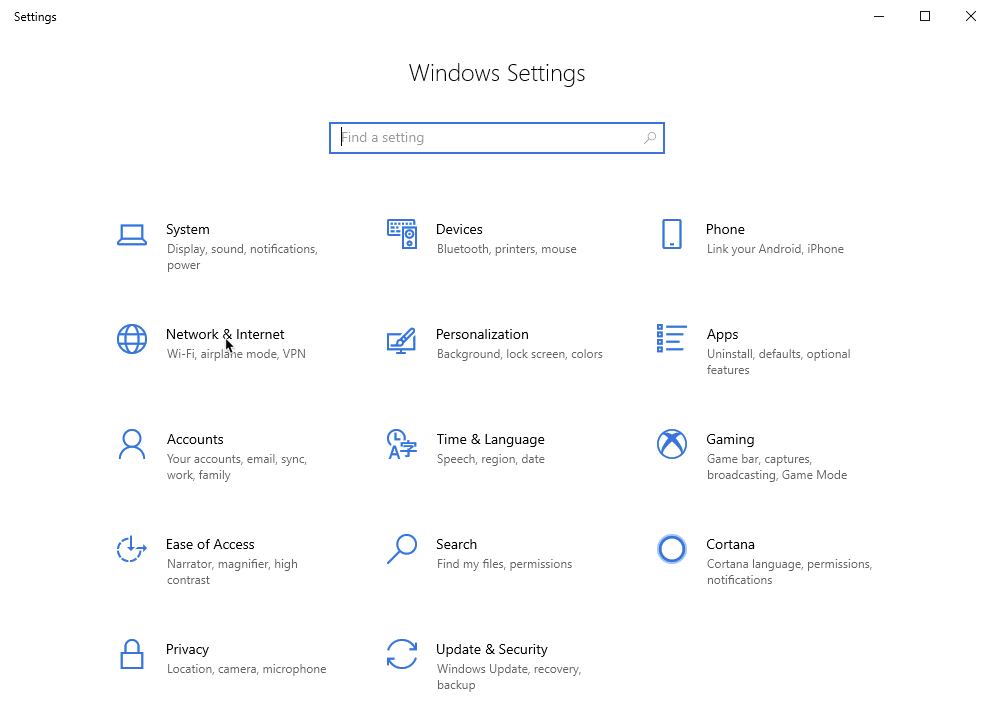

Las siguientes instrucciones se aplican a Microsoft Windows 10 con su cliente VPN nativo:

#### Crear una conexión VPN de red
1. Ve al menú *Inicio* > *Configuración* > *Red e Internet*.

2. Haz clic en *VPN*.

3. Haz clic en *Añadir una conexión VPN*.

4. En la página *Agregar una conexión VPN*:
- **Proveedor de VPN:** *Windows (integrado)*
- **Nombre de la conexión:** Ingrese un nombre para tu conexión VPN (p. ej., **acme-vpn**)
- **Nombre o dirección del servidor:** Ingresa la dirección IP pública de la página *VPN de acceso remoto*
- **Tipo de VPN:** Selecciona *L2TP/IPSec con clave precompartida*
- **Clave precompartida:** Ingresa la clave precompartida de la página *VPN de acceso remoto*
- **Tipo de información de inicio de sesión:** Selecciona *Nombre de usuario y contraseña*
- **Nombre de usuario:** Ingresa el nombre de usuario de la VPN que su administrador creó para ti
- **Contraseña:** Ingresa la contraseña especificada para la VPN

5. Haz clic en *Guardar*. Aparecerá la página *VPN* y la nueva conexión aparecerá en la lista de conexiones.

#### Iniciar conexión VPN
1. Ve al menú *Inicio* > *Configuración* > *Red e Internet* > *VPN*.
2. Selecciona la conexión VPN deseada y, a continuación, haz clic en el botón *Conectar*.

3. La VPN ya está conectada.

<!--  -->
