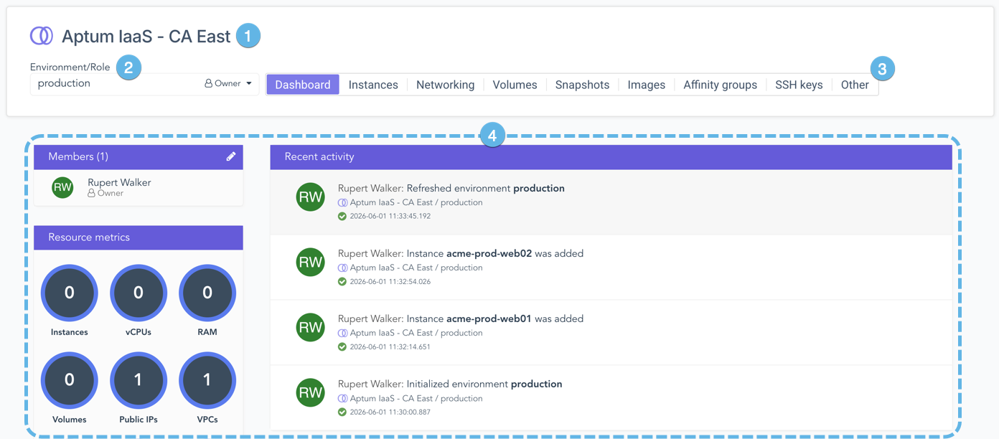
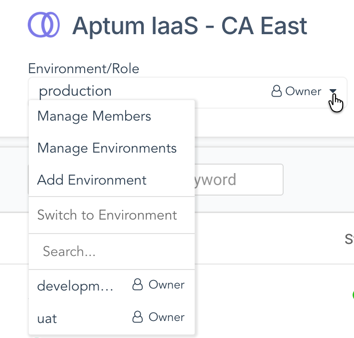

Este artículo presenta el concepto de entornos en Aptum Portal, su relación con las conexiones de servicio y cómo utilizarlos para organizar usuarios y cargas de trabajo.

## Introducción

En Aptum Portal, las conexiones de servicio (o simplemente *servicios*) proporcionan el mecanismo para conectarse a un servicio remoto, como un proveedor de nube. Para acceder a los recursos que ofrece el servicio remoto, los usuarios de Aptum Portal interactúan con una entidad denominada entorno, que reside dentro de una conexión de servicio. Cada entorno tiene sus propios recursos, independientes de los demás, incluso de aquellos que se encuentran en la misma conexión de servicio. Esto permite la existencia de entornos distintos para aislar las cargas de trabajo de producción de los sistemas de desarrollo o para establecer entornos aislados específicos para cada proyecto. Además, un entorno solo es accesible para los usuarios que se han añadido como miembros o para aquellos cuyo nivel de privilegios anula el comportamiento predeterminado.

Los entornos actúan como contenedores lógicos, abstraiendo la funcionalidad, que puede variar considerablemente entre los diferentes tipos de conexiones de servicio. Para obtener más información sobre las entidades a las que se asigna un entorno en un servicio específico, consulta el artículo de resumen de dicho servicio. Además, el sistema calcula el uso del servicio a nivel de organización para fines de facturación, y los recursos consumidos por cada entorno se registran por separado, lo que permite a las empresas generar informes internos de facturación por entorno si así lo desean.

Existen dos métodos para agregar entornos, según la conexión de servicio:

- Crear un nuevo entorno vacío, que se aprovisionará automáticamente en el servicio remoto.

- Crear un enlace a recursos ya existentes en el servicio remoto, que aparecerá en CloudOps como un entorno.

No todas las conexiones de servicio admiten ambos métodos. Además, los entornos que se vinculan a recursos existentes normalmente serán creados por su administrador.

## Acceso a los entornos

Para acceder a los entornos, ve al menú **Servicios** y haz clic en el servicio deseado. Esto te llevará a la página **Entornos** de dicho servicio. En esta página se muestran todos los entornos del servicio seleccionado que son visibles para el usuario actual.

1. **Identificador de servicio**

    Muestra el nombre de la conexión de servicio seleccionada. Además, esta sección muestra el código para acceder a esta conexión mediante la API de Aptum Portal.

2. **Lista de entornos**

    En el área principal del espacio de trabajo, aparece una lista de todos los entornos del servicio seleccionado.

3. **Cuadro de búsqueda**

    Escribe en el cuadro de búsqueda para filtrar la lista de entornos. El sistema buscará en los campos de nombre de entorno y devolverá cualquier instancia que coincida con la cadena de texto.

4. **Agregar entorno**

    Al hacer clic en este botón, se abrirá el asistente para **Agregar entorno**.

5. **Entrada de entorno**

    Cada entrada incluye el nombre del entorno, su estado, el rol asignado y un resumen de los avatares de los miembros agregados. Haz clic en una entrada para ver los recursos del entorno.

6. **Menú de acciones escondidas**

    Cada entrada en la lista de entornos tiene un menú de acciones escondidas. Haz clic en el menú de acciones escondidas para acceder a una lista de las operaciones más utilizadas en este entorno.

## Membresía, roles de entorno y entornos restringidos

Un entorno pertenece a una organización y está contenido dentro de un servicio específico. Sin embargo, a menos que se configure específicamente, no todos los usuarios de esa organización tendrán acceso a dicho entorno. Los usuarios deben agregarse primero como miembros. Para agregar o eliminar miembros de un entorno, utiliza su menú de acciones escondidas y selecciona **Gestionar miembros**. Alternativamente, desde dentro de un entorno, el menú <a href="#environment-menu">Entorno</a> también permite acceder a la página **Gestionar miembros**.

La membresía de un entorno está vinculada a un rol de entorno. El rol de entorno controla lo que un usuario puede hacer con los recursos contenidos en el entorno. El sistema proporciona roles de entorno básicos, y el administrador puede definir roles de entorno personalizados adaptados a tus necesidades. Ciertos roles del sistema también otorgan visibilidad de los entornos a los usuarios con niveles de privilegio superiores, incluso si no son miembros de un entorno determinado. Consulta [Controles de acceso basados ​​en roles](../administration/rbac.md) para obtener más información sobre los roles del sistema y del entorno.

Al crear un nuevo entorno, se ofrecen dos opciones relacionadas con el control de acceso. La primera permite **asignar miembros externos** al entorno. Si esta opción está habilitada, el menú emergente **Añadir miembro al entorno** aceptará nombres de usuario de otras organizaciones al introducirlos en el campo de búsqueda.

La segunda opción, **Entorno restringido**, modifica la capacidad de un usuario con el rol principal de Administrador (o un rol personalizado con el permiso **Administrador:Entornos: Poseer todos**) para interactuar con dicho entorno y asignar roles a los miembros. Al seleccionar esta opción, aparecerá un menú emergente que permitirá al creador del entorno seleccionar roles de una lista. Una vez creado el entorno, los usuarios con el rol principal de Administrador (o un rol personalizado con el permiso **Adminstrador:Entornos: Poseer todos**) solo verán los roles seleccionados en la página **Gestionar miembros**. Tampoco tendrán acceso completo al entorno, no podrán eliminarlo ni modificar su nombre, descripción o rol predeterminado. Ten en cuenta que los entornos restringidos no se aplican a los usuarios de Revendedor.

Para otorgar automáticamente la membresía a todas las cuentas de usuario de la organización propietaria del entorno, haz clic en la opción **Todos los usuarios (Membresía automática)** del menú emergente **Agregar miembro al entorno** en la página **Gestionar miembros**. Te le pedirá que selecciones el rol que se asignará a estos miembros. Si un miembro se agrega específicamente a un entorno con la membresía automática habilitada, el rol asignado a dicho miembro tendrá prioridad sobre el rol asignado por la membresía automática.

## Dentro de un entorno

1. **Identificador de servicio**

    Muestra el nombre de la conexión de servicio donde reside este entorno.

2. **Menú del entorno**

    Consulta la sección <a href="#environment-menu">Menú del entorno</a> para obtener más información.

3. **Barra de herramientas de funciones**

    Permite al usuario navegar a la página del panel de control del entorno, así como a otras páginas que muestran las funciones disponibles a través de esta conexión de servicio.

4. **Información adicional**

    El resto del tablero de control proporciona información adicional sobre los miembros, los recursos disponibles y la actividad reciente dentro del entorno.

Según el tipo de servicio, la barra de herramientas mostrará diferentes elementos disponibles. Sin embargo, todos los servicios contarán con un tablero de control. La página predeterminada al acceder a un entorno variará según el tipo de servicio.

## Menú de entorno

Utiliza el menú de entorno para cambiar rápidamente entre entornos en la misma conexión de servicio y para acceder a las funciones de administración de entornos:

- La opción **Gestionar miembros** te llevará a la página **Gestionar miembros**.
- La opción **Gestionar entornos** te devolverá a la página de entornos de la conexión de servicio actual.
- La opción **Agregar entorno** abrirá el asistente **Agregar entorno** para la conexión de servicio actual.
- Las demás opciones del menú permiten al usuario buscar entornos en la conexión de servicio actual o seleccionar uno directamente de una lista.

-   **[Crear un nuevo entorno](create-a-new-environment.md)**  

