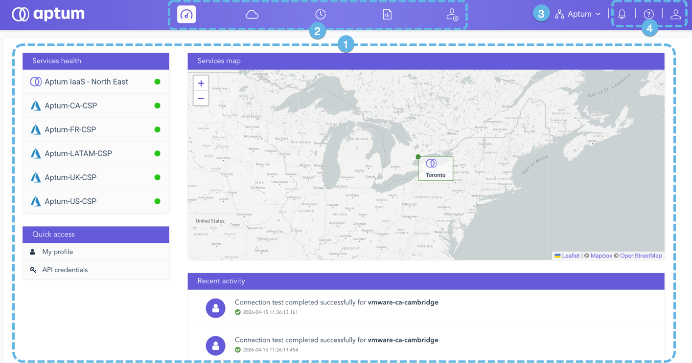

La página de inicio de Aptum Portal es la página predeterminada que se le presenta a un usuario cuando inicia sesión en el sistema.

1.  **El espacio de trabajo**

    El espacio de trabajo es la sección principal de todas las pantallas de Aptum Portal. Los elementos que son visibles en el espacio de trabajo están determinados por el contexto de su ubicación en el sistema. Por ejemplo, en la página de inicio que se muestra aquí, puedes encontrar el mapa de servicios, el panel de acceso rápido, así como resúmenes del estado del sistema y la actividad reciente.

2.  **Botones de navegación principales**

    Los botones de navegación principales de cualquier pantalla de Aptum Portal. Desde aquí puede acceder a las principales funciones del sistema, incluidas las conexiones de servicio, los informes, los registros de actividad y la administración.

3.  **Selector de organización**

    Aptum Portal es una plataforma multiusuario. Utilice el selector de organización para navegar entre las organizaciones y suborganizaciones a las que tiene acceso.

4.  **Menús de ayuda, notificaciones y configuración de usuario**

    En la esquina superior de cualquier pantalla de CloudOps encontrará tres elementos: el menú de ayuda, el menú de notificaciones y el menú de configuración de usuario.