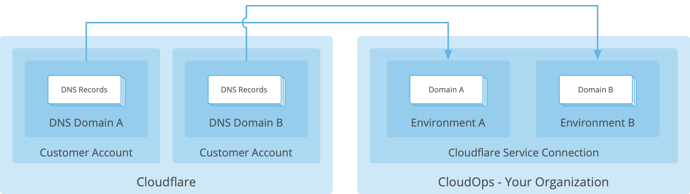
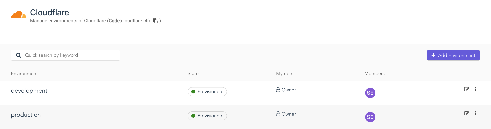
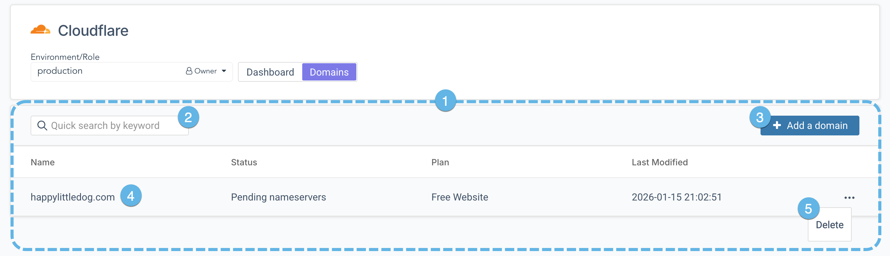
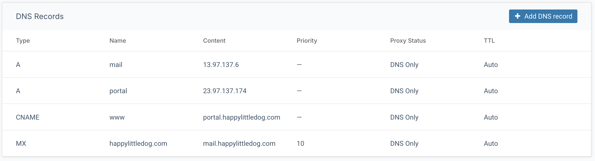

Este artículo presenta el servicio DNS de Cloudflare para la creación y gestión de dominios, registros y cuentas a través de entornos de Aptum Portal.

## Descripción general

El servicio DNS de Cloudflare proporciona resolución de nombres de alto rendimiento para aplicaciones a gran escala, con distribución global y seguridad confiable. Aptum Portal se integra con el servicio DNS, permitiendo la gestión de zonas, incluyendo la adición y eliminación de registros DNS. Esta integración permite administrar múltiples zonas desde un único entorno de Aptum Portal.

Para que la resolución DNS funcione correctamente, tu dominio debe estar configurado en el registrador de nombres para que apunte a los servidores de nombres de Cloudflare. Cloudflare alojará los registros DNS \(también conocidos como **registros de recursos**\) de tu dominio. La interfaz de Aptum Portal ofrece una forma sencilla de gestionar estos registros de recursos junto con tus otros servicios en la nube.

Para mejorar el rendimiento y la seguridad, también se puede configurar Cloudflare para que actúe como proxy para el tráfico de tus registros A, AAAA y CNAME. Cuando un cliente realiza una consulta DNS para el nombre de host de un registro DNS proxy, Cloudflare devuelve la dirección IP de tus propios servidores front-end. Cuando el cliente realiza una solicitud HTTP o HTTPS, la envía a los servidores de Cloudflare, que a su vez la envían al servidor de origen, identificado en tu registro DNS. Este contenido se devuelve en la respuesta al cliente y también se almacena en caché en los servidores de Cloudflare para una recuperación más rápida.

## Entornos

Para empezar a trabajar con los recursos de Cloudflare, crea un nuevo entorno en el servicio de Cloudflare en Aptum Portal. Al crear un nuevo entorno, se creará automáticamente una nueva cuenta en Cloudflare y se asociará al entorno en Aptum Portal.

Si se produce un error al crear un nuevo entorno, es posible que la clave API de Cloudflare utilizada para crear la conexión de servicio no tenga los permisos adecuados. Pónte en contacto con tu administrador de Cloudflare y asegúrate de que la cuenta maestra haya otorgado a la clave API los siguientes permisos:

-   `Zone.Zone Settings`
-   `Zone.Zone`
-   `Zone.DNS`
-   `Global xauth key`

## Dominios

Al hacer clic en un entorno, accederás a una lista de los dominios gestionados en dicho entorno, donde podrás añadir nuevos dominios. Al añadir un dominio, tienes la opción de que el sistema lo escanee e importe los registros de recursos existentes. Una vez añadido, el dominio permanecerá en estado `Pending nameservers` hasta que el registrador de dominios se configure para apuntar a los servidores de nombres de Cloudflare.

1. **Lista de dominios**

    En el área principal del espacio de trabajo, aparece una lista de todos los dominios del entorno seleccionado.

2. **Cuadro de búsqueda**

    Escribe en el cuadro de búsqueda para filtrar la lista de dominios. El sistema buscará en los campos de nombre y fecha de última modificación, y mostrará cualquier dominio que coincida con la cadena de búsqueda.

3. **Agregar un dominio**

   Haz clic para definir un dominio que se alojará en Cloudflare.

   Opcionalmente, al crear el dominio, también se pueden importar los registros DNS existentes para el dominio de destino.

4. **Entrada de dominio**

   Cada entrada incluye el nombre del dominio, el estado de la configuración del dominio, el tipo de plan y la fecha de última modificación.

   Haz clic en la entrada para acceder a la página de detalles del dominio.

5. **Menú de acciones escondidas**

    Cada entrada en la lista de dominios tiene un menú de acciones escondidas. Haz clic en el menú de acciones escondidas para acceder a una lista de las operaciones más utilizadas para el dominio.

## Registros DNS

Haz clic en un dominio para ver los servidores de nombres actuales y sus direcciones IP, así como una lista de todos tus registros de recursos.

Si el sistema detecta que el registrador del dominio no está configurado para que apunte a los servidores DNS de Cloudflare, mostrará un mensaje informativo indicando que este paso es necesario y también proporcionará los servidores de nombres y sus direcciones IP tal como deben configurarse en el registrador.

La lista de registros DNS contendrá los campos estándar para cada registro de recursos e indicará si el tráfico para ese nombre de host se gestiona mediante proxy.

