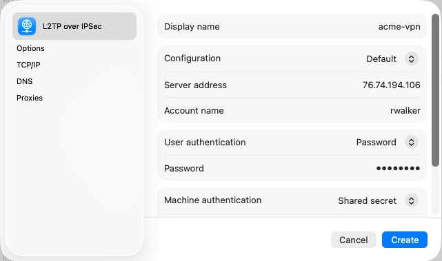
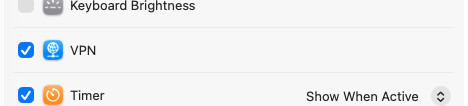

Ce système d'exploitation intègre un client VPN IPSec. Voici la procédure pour configurer une connexion VPN :

#### Créer la connexion VPN

1. Ouvrez *Réglages système* > *Réseau*.
   
1. Cliquez sur le menu contextuel **...**, puis sur **Ajouter une configuration VPN** > **L2TP par IPSec...** :
    - **Nom d'affichage :** Entrez un nom pour votre connexion VPN (par exemple, **acme-vpn**).
    - **Configuration :** Laissez la valeur par défaut.
    - **Adresse du serveur :** Entrez l'adresse IP publique indiquée sur la page *Accès VPN à distance*.
    - **Nom du compte :** Entrez le nom d'utilisateur du compte VPN créé par votre administrateur.
    - **Authentification de l'utilisateur :** Sélectionnez *Mot de passe*.
    - **Mot de passe :** Entrez le mot de passe du compte VPN.
    - **Authentification de la machine :** Sélectionnez *Secret partagée*.
    - **Secret partagée :** Entrez la clé pré-partagée indiquée sur la page *Accès VPN à distance*.
    - **Nom du groupe :** Laissez ce champ vide.
   
1. Cliquez sur *Créer*.
1. Le nouveau VPN est maintenant disponible sur la page *VPN*. Cliquez sur le bouton pour vous connecter au VPN.
   

Vous pouvez activer le module VPN dans la barre de menu pour y accéder plus facilement :
1. Ouvrez *Réglages système* > *Barre de menus*.
2. Faites défiler jusqu'à l'option *VPN* dans les commandes de la barre de menus.
3. Cliquez sur le bouton pour afficher le module VPN dans la barre de menus.
   
4. Vous pouvez maintenant vous connecter au VPN à partir de la barre de menus.
   