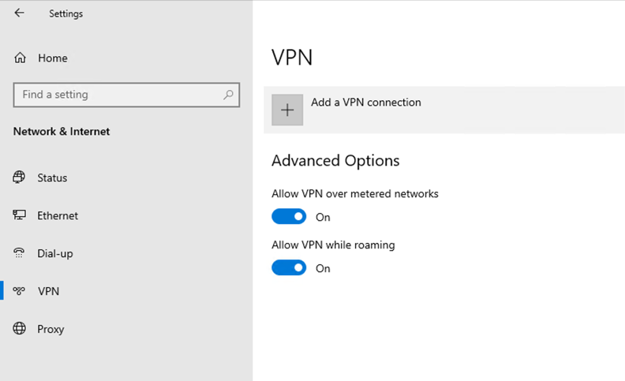
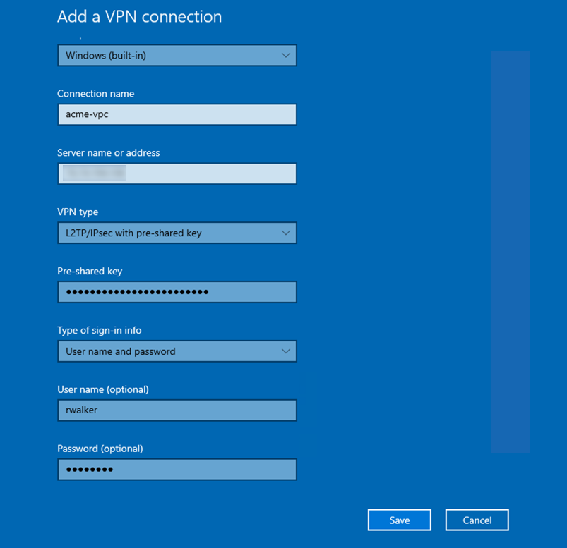
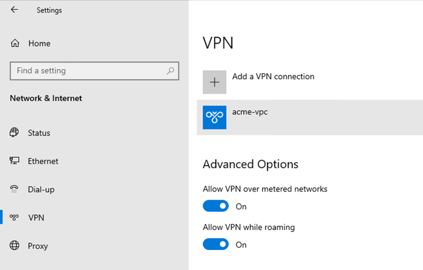

Les instructions suivantes s'appliquent à Microsoft Windows 10 utilisant son client VPN natif :

#### Créer une connexion VPN réseau

1. Allez à *Menu Démarrer* > *Paramètres* > *Réseau et Internet*.

2. Cliquez sur *VPN*.

3. Cliquez sur *Ajouter une connexion VPN*.

4. Sur la page *Ajouter une connexion VPN* :
- **Fournisseur VPN :** *Windows (intégré)*
- **Nom de la connexion :** Entrez un nom pour votre connexion VPN (par exemple, **acme-vpn**)
- **Nom ou adresse du serveur :** Entrez l’adresse IP publique indiquée sur la page *VPN d’accès distant*
- **Type de VPN :** Sélectionnez *L2TP/IPSec avec clé pré-partagée*
- **Clé pré-partagée :** Entrez la clé pré-partagée indiquée sur la page *VPN d’accès distant*
- **Type d’informations de connexion :** Sélectionnez *Nom d’utilisateur et mot de passe*
- **Nom d’utilisateur :** Entrez le nom d’utilisateur du compte VPN créé par votre administrateur
- **Mot de passe :** Entrez le mot de passe du compte VPN

5. Cliquez sur *Sauvegarder*. La page *VPN* s'affichera et la nouvelle connexion apparaîtra dans la liste des connexions.

#### Établir une connexion VPN
1. Allez à *Menu Démarrer* > *Paramètres* > *Réseau et Internet* > *VPN*.
2. Cliquez sur la connexion VPN souhaitée, puis sur le bouton *Se connecter*.

3. Le VPN est maintenant connecté.

<!--  -->
