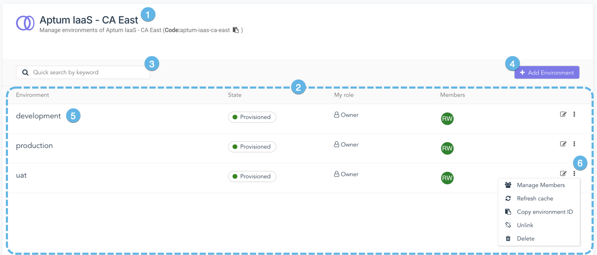

Cet article présente le concept d'environnements dans Aptum Portal, leur lien avec les connexions de service et comment les utiliser pour organiser vos utilisateurs et vos charges de travail.

## Aperçu

Dans Aptum Portal, les connexions de service (ou simplement *services*) permettent de se connecter à un service distant, comme un fournisseur infonuagique. Pour accéder aux ressources fournies par ce service distant, les utilisateurs de Aptum Cloud interagissent avec une entité appelée environnement, qui existe au sein d'une connexion de service. Chaque environnement possède ses propres ressources, distinctes de toutes les autres, même celles appartenant à la même connexion de service. Cela permet de créer des environnements distincts afin d'isoler les charges de travail de production des systèmes de développement, ou de mettre en place des environnements isolés spécifiques à un projet. De plus, un environnement est accessible uniquement aux utilisateurs qui y ont été ajoutés en tant que membres, ou à ceux dont le niveau de privilèges dépasse le comportement par défaut.

Les environnements agissent comme des contenants logiques, masquant des fonctionnalités qui peuvent varier considérablement d'un type de connexion de service à l'autre. Pour plus d'informations sur les entités auxquelles un environnement correspond dans un service spécifique, consultez l'article d'aperçu  de ce service. De plus, le système calcule l'utilisation du service au niveau de l'organisation à des fins de facturation, et les ressources consommées par chaque environnement sont également suivies séparément, ce qui permet aux entreprises de générer des rapports de refacturation internes par environnement si elles le souhaitent.

Il existe deux méthodes pour ajouter des environnements, selon la connexion au service :

- Créer un nouvel environnement vide, qui sera provisionné automatiquement dans le service distant.

- Créer un lien vers des ressources existantes dans le service distant, qui apparaîtront dans Aptum Portal comme un environnement.

Ces deux méthodes ne sont pas compatibles avec toutes les connexions au service. De plus, les environnements liés à des ressources existantes sont généralement créés par votre administrateur.

## Accès aux environnements

Pour accéder aux environnements, rendez-vous dans le menu **Services**, puis cliquez sur le service souhaité. Vous accéderez ainsi à la page **Environnements** de ce service. Cette page répertorie tous les environnements du service sélectionné visibles par l'utilisateur actuel.

1. **Identifiant du service**

    Affiche le nom de la connexion de service présentement sélectionnée. Cette section affiche également le code permettant d'accéder à cette connexion via l'API Aptum Portal.

2. **Liste des environnements**

    Dans la zone principale de l'espace de travail, la liste de tous les environnements du service sélectionné s'affiche.

3. **Zone de recherche**

    Entrez du texte dans la boîte de recherche pour filtrer la liste des environnements. Le système effectuera une recherche dans les champs de nom d'environnement et affichera les résultats correspondant à la chaîne de caractères saisie.

4. **Ajouter un environnement**

    Cliquer sur ce bouton ouvre l'assistant **Ajouter un environnement**.

5. **Entrée d'environnement**

    Chaque entrée comprend le nom de l'environnement, son état, le rôle qui vous a été attribué et une liste récapitulative des avatars des membres ajoutés. Cliquez sur une fiche pour voir les ressources de l'environnement.

6. **Menu des actions cachées**

    Chaque environnement possède un menu des actions cachées. Cliquez dessus pour accéder à la liste des opérations fréquemment utilisées.

## Appartenance, rôles et environnements restreints

Un environnement appartient à une organisation et est inclus dans un service spécifique. Cependant, à moins d'une configuration particulière, tous les utilisateurs de cette organisation n'y auront pas accès. Ils doivent d'abord y être ajoutés en tant que membres. Pour ajouter ou supprimer des membres d'un environnement, utilisez son menu des actions cachées et sélectionnez **Gérer les membres**. Vous pouvez également accéder à la page **Gérer les membres** depuis l'environnement via le <a href="#environment-menu">menu de l'environnement</a>.

L'appartenance à un environnement est associée à un rôle. Ce rôle détermine les actions qu'un utilisateur peut poser sur les ressources de l'environnement. Le système offre des rôles d'environnement de base, et votre administrateur peut définir des rôles personnalisés selon vos besoins. Certains rôles système permettent également aux utilisateurs disposant de privilèges élevés d'accéder aux environnements, même s'ils n'en sont pas membres. Consultez la documentation relative au contrôle d'accès basé sur les rôles ([Contrôles d'accès basés sur les rôles](../administration/rbac.md)) pour plus d'informations sur les rôles système et d'environnement.

Lors de la création d'un environnement, deux options de contrôle d'accès sont disponibles. Tout d'abord, une option permet d'**autoriser les membres externes** à l'environnement. Si cette option est activée, le menu contextuel **Ajouter un membre à l'environnement** acceptera les noms d'utilisateur d'autres organisations lorsqu'ils seront entrés dans son champ de recherche.

La deuxième option, **Environnement restreint**, modifie les droits d'un utilisateur disposant du rôle principal Administrateur (ou d'un rôle personnalisé avec l'autorisation **Administrateur:Environnements: Posséder tous**) d'interagir avec cet environnement et d'attribuer des rôles aux membres. Lorsque cette option est sélectionnée, un menu contextuel s'affiche et permet au créateur de l'environnement de choisir parmi une liste de rôles. Une fois l'environnement créé, les utilisateurs disposant du rôle principal Administrateur (ou d'un rôle personnalisé avec l'autorisation **Administrateur:Environnements: Posséder tous**) ne verront que les rôles sélectionnés sur la page **Gérer les membres**. Ils n'auront pas un accès complet à l'environnement, ne pourront ni le supprimer ni modifier son nom, sa description ou le rôle par défaut. Notez que les environnements restreints ne s'appliquent pas aux revendeurs.

Pour ajouter automatiquement un membre à l'environnement à tous les comptes utilisateurs de l'organisation propriétaire, cliquez sur **Tous les utilisateurs (Gestion automatique du rôle par défaut)** dans le menu contextuel **Ajouter un membre à l'environnement** de la page **Gérer les membres**. Vous serez invité à choisir le rôle qui sera attribué à ces membres. Si un membre est ajouté manuellement à un environnement où l'inscription automatique est activée, le rôle qui lui est attribué directement l'emportera sur celui attribué automatiquement.

## Dans un environnement

1. **Identifiant du service**

    Affiche le nom de la connexion de service où se trouve cet environnement.

2. **Menu de l'environnement**

    Consultez la section <a href="#environment-menu">Menu de l'environnement</a> pour plus d'informations.

3. **Barre d'outils des fonctionnalités**

    Permet à l'utilisateur d'accéder au tableau de bord de l'environnement, ainsi qu'à diverses autres pages présentant les fonctionnalités disponibles via cette connexion de service.

4. **Renseignements supplémentaires**

    Le reste du tableau de bord fournit des renseignements supplémentaires sur les membres, les ressources disponibles et les activités récentes dans l'environnement.

Selon le type de service, la barre d'outils affichera différents éléments. Cependant, tous les services auront une page de tableau de bord. La page par défaut affichée lors de l'accès à un environnement variera selon le type de service.

## Menu de l'environnement

Utilisez le menu de l'environnement pour basculer rapidement entre les environnements d'une même connexion de service et accéder aux fonctionnalités de gestion des environnements :

- L'élément **Gérer les membres** vous redirige vers la page **Gérer les membres**.

- L'élément **Gérer les environnements** vous ramène à la page des environnements de la connexion de service actuelle.

- **Ajouter un environnement** ouvre l'assistant **Ajouter un environnement** pour la connexion de service actuelle.

- Les autres éléments du menu vous permettent de rechercher des environnements dans la connexion de service actuelle ou d'en sélectionner un directement dans la liste.

-   **[Créer un nouvel environnement](create-a-new-environment.md)**  

